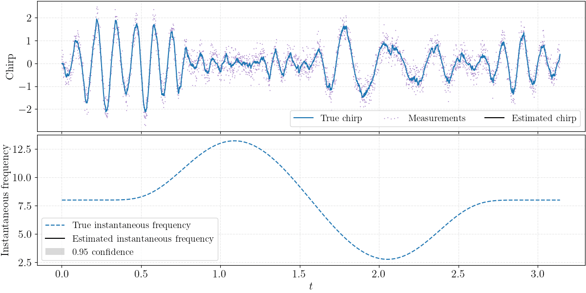

# Probabilistic chirp instantaneous frequency estimation using Gaussian processes
[](https://github.com/spdes/chirpgp/actions/workflows/unittest.yml)

Companion implementation of the paper "Probabilistic Estimation of Chirp Instantaneous Frequency Using Gaussian Processes".

The preprint is available at [http://arxiv.org/abs/2205.06306](http://arxiv.org/abs/2205.06306).

Please cite as follows to use the codes.

```bibtex
@article{ZhaoZheng2023Chirp,
	title = {Probabilistic Estimation of Instantaneous Frequencies of Chirp Signals},
	journal = {IEEE Transactions on Signal Processing},
	author = {Zheng Zhao and Simo S\"{a}rkk\"{a} and Jens Sj\"{o}lund and Thomas B. Sch\"{o}n},
	year = {2023}, 
	note = {In press}
}
```

# Problem formulation

Consider a chirp signal of the form

$$
Y_k = \sin\biggl( \phi_0 + 2 \\, \pi \int^{t_k}_0 f(s) \\, \mathrm{d}s \biggr) + \xi_k, \quad \xi_k \sim \mathrm{N}(0, \Xi_k).
$$

In the equation above, $\phi_0$ stands for the initial phase, $\xi_k$ is a Gaussian noise, $Y_k$ stands for the noisy chirp measurement at time $t_k$, and $f$ is the instantaneous frequency function that we aim to estimate. Importantly, we would like to estimate $f$ in terms of posterior distribution.

The idea is to put priors on both $f$ and the chirp signal jointly by using a class of non-linear stochastic differential equations -- which gives some condtional Gaussian processes. This leads to a non-linear state-space model in which we can estimate the posterior distribution by using stochastic filters and smoothers (e.g., EKFS, UKFS).

To have a sense how well this method works, please see the following example figure taken from the paper.



# Installation

This implementation is based on JaX, as we need auto-differentiation. Please refer to
this [official guidance](https://github.com/google/jax#installation) to install JaX. Then open a terminal and use the
following commands to install our `chirpgp` package:

1. `git clone git@github.com:spdes/chirpgp.git`
2. `cd chirpgp`
3. `pip install -r requirements.txt`
4. `python setup.py install` or `python setup.py develop`

# Examples

There are a plenty of demos in folder `./demos`. These demos are written self-contained and pedagogical, helping you
understand how the method works.

Try read and run, for example, the script `./demos/ghfs_mle.py`.

# Project structure

The following list explains what the folders in this repository are.

- `./chirpgp`: This is the Python package folder.
- `./demos`: This folder contains runnable demos for a synthetic toymodel. It is very recommended to check this out.
- `./docs`: A placeholder for future documentation.
- `./paper_plots_tables`: Scripts in this folder reproduce the plots and tables in our paper.
- `./real_application`: Real applications.
- `./test`: Unit tests.
- `./tetralith`: If you would like to exactly reproduce the numerical results in our paper, you need to run the scripts
  in this folder. Please refer to the `README.md` within for how to do so.

# Filtering and smoothing module

This package also ships with a submodule for stochastic filtering and smoothing written
in `./chirpgp/filters_smoothers.py`. It supports:

- Kalman filter and RTS smoother in discrete time.
- Extended Kalman filter and smoother in discrete time and continuous-discrete time.
- Sigma-points filters and smoothers in discrete time and continuous-discrete time. Supports Gauss--Hermite and
  spherical cubature sigma points, and the 4th-order Runge--Kutta integration.

# Contact

Zheng Zhao, Uppsala University (2022)

https://zz.zabemon.com

zheng.zhao@it.uu.se, zz@zabemon.com

# License

The GNU General Public License v3.0 or later.
